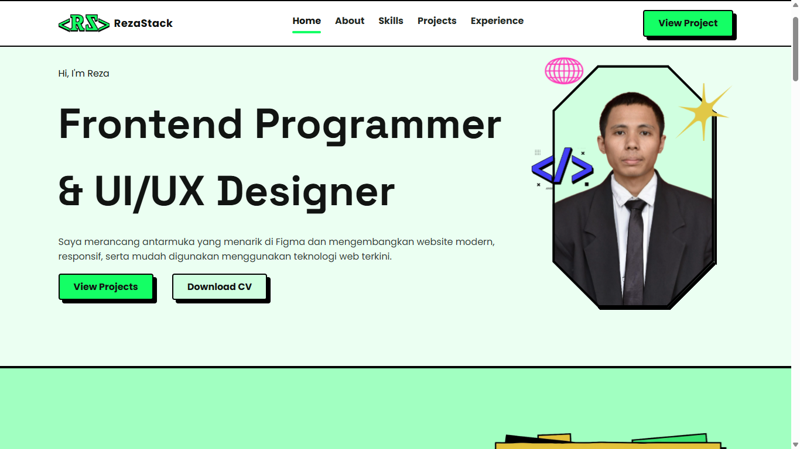

# RezaStack Portfolio Web

A modern personal portofolio website build to showcase my projects, skills, and experience as a Frontend Developer and UI/UX Designer.

## Website Link

[RezaStack Portofolio](https://bladumdum.github.io/rezastack-portofolio)

## Figma Link

[Figma Design](https://www.figma.com/design/9quVPQW7GFEd99l6DDerFJ/portofolio?node-id=156-60&t=uAtpmBCPMWMMGhni-0)

## Features

- In-Page Navigation
- Click-to-chat Whatsapp
- Responsive Design
- Project Showcase

## Tech Stack

### UI/UX

- Figma
  

### Frontend

- HTML
- CSS
- JavaScript

### Backend

- JavaScript

## Installation

1. Clone repository
2. Open the project folder
3. Open index.html in your browser

## Project Structure

assets/
css/
script/
index.html

## Usage

Navigate using the menu.

Click "View Projects" to see my projects.

Click "Download CV" to download my resume.

## Future Improvements

- Dark Mode
- Blog Section
- Comments Section
- Better Animation

## Author

Muhammad Dwi Reza

Frontend Developer & UI/UX Designer

[Github](https://github.com/bladumdum)
